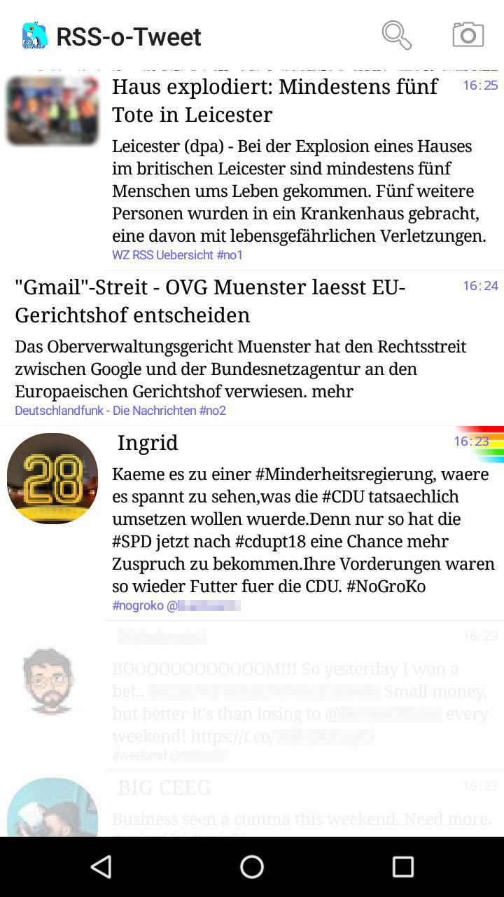
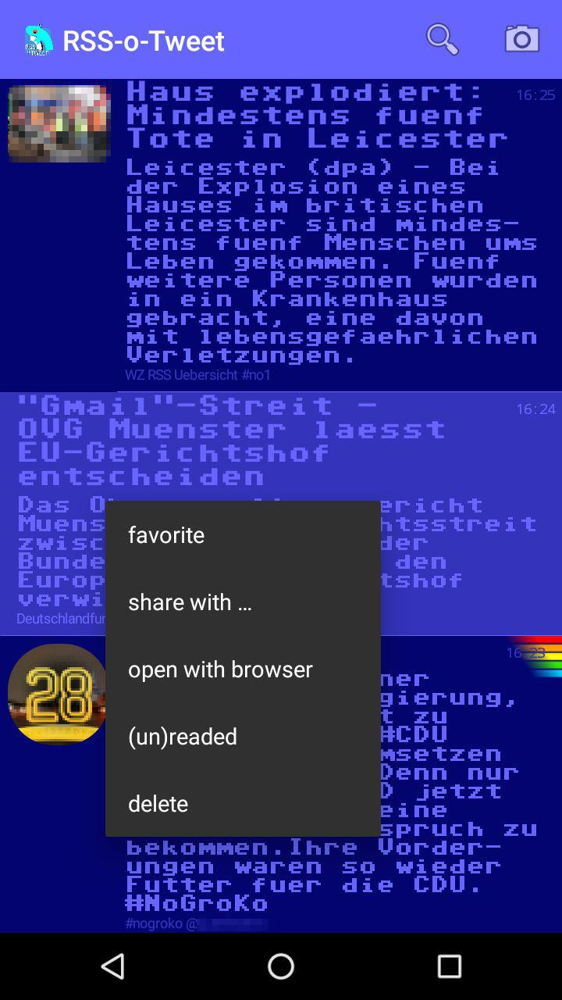
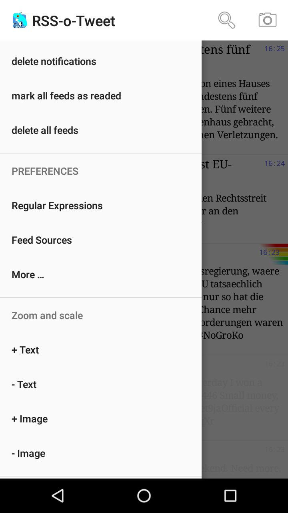
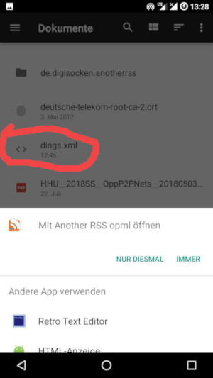
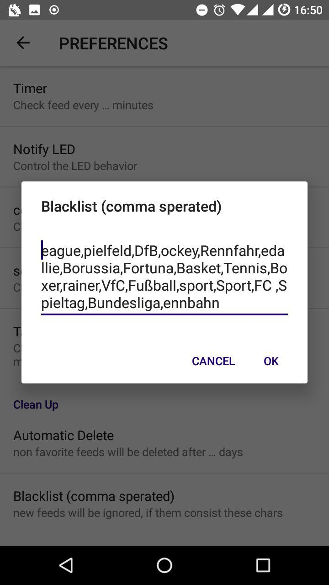
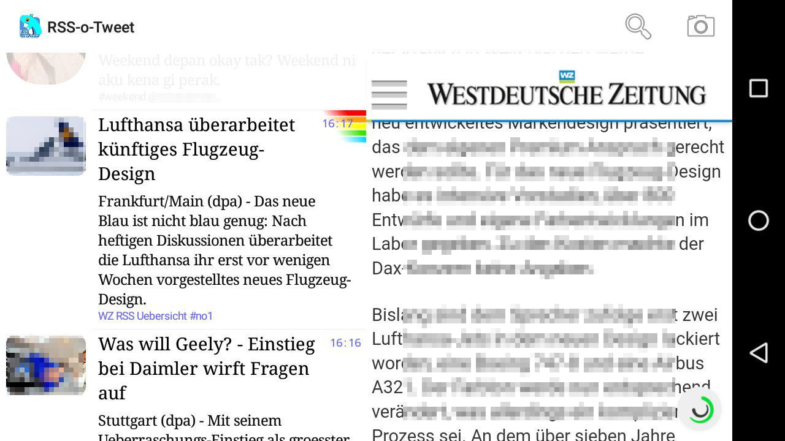
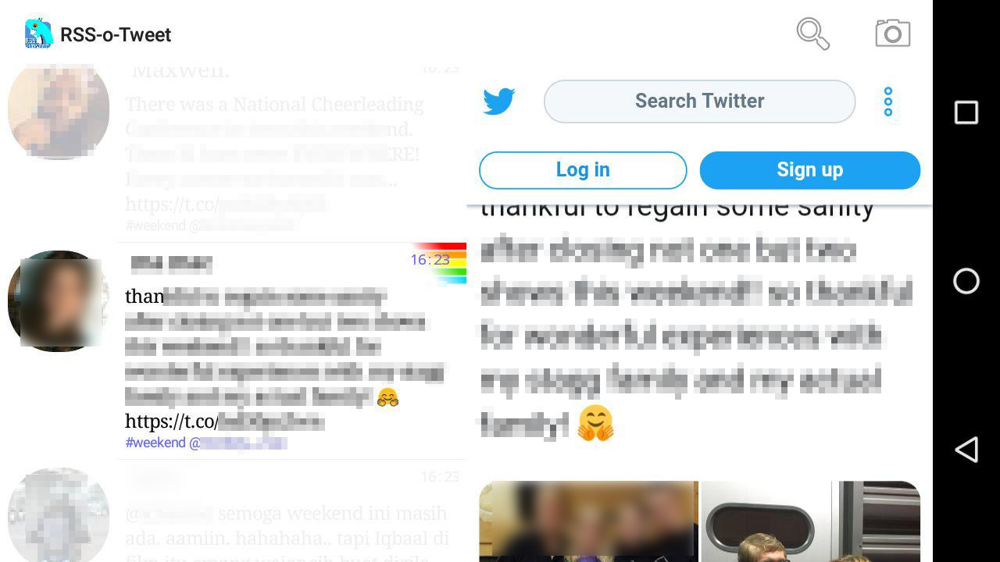

# RSS-o-Tweet

This Branch: Get a Twitter API Key and this version get additional Timelines of users and hashtags.

This is a Atom RSS Feed Reader and and Twitter Timeline and Hashtag Reader. It very similar to [ViboraFeed](https://github.com/no-go/ViboraFeed). You can add many RSS-Urls, Hashtags or Usernames (timelines).

Support me: 

## Get the App

You can get a signed APK from here (Android 4.1+): [APK](https://raw.githubusercontent.com/no-go/AnotherRSS/tweeted/app/release/app-release.apk)

## Features

- english only interface
- c64 ttf font
- it is BLUE in night
- newspaper style
- everyting in one list
- RSS images and twitter avatar
- landscape mode with web preview
- search text content
- night mode
- every news is a notification
- ignore mode
- mark feeds as deleted, readed, favourite
- good blacklist (german sports, only on first open it in prefenences it gets active)
- improvement to open xml and rss ending links in Rss-o-Tweet as new source
- regex
- widget (only first source) with preview and without exception
- icon alternative (72x72)
- no error notifications about "ups no internet"
- Text and Image is resizeable
- Tab behavior changeable
- THE TWITTER STUFF IS AN OPTION !
- ignore retweets as an option
- activate or deactivate different sources
- the App does not need a SD-Card or memory access
- many more ...

- Optional: login to Twitter and tweet a low resuluton (!) picture and some text

## Podcast improvement

If a feed url ends with .podcast and the links ends with .mp3 the App does
not open Browser. It plays the mp3 from the internet (it does not download
and cache it!!).

## Bugs

- see issue in master branch
- to test: tweets only update at first time (add api key+secret)
- not very power saving (maybe ignore mode is bad?)

## Screenshots

## License

This is free and unencumbered software released into the public domain.

Anyone is free to copy, modify, publish, use, compile, sell, or distribute this software, either in source code form or as a compiled binary, for any purpose, commercial or non-commercial, and by any means.

In jurisdictions that recognize copyright laws, the author or authors of this software dedicate any and all copyright interest in the software to the public domain. We make this dedication for the benefit of the public at large and to the detriment of our heirs and successors. We intend this dedication to be an overt act of relinquishment in perpetuity of all present and future rights to this software under copyright law.

THE SOFTWARE IS PROVIDED "AS IS", WITHOUT WARRANTY OF ANY KIND, EXPRESS OR IMPLIED, INCLUDING BUT NOT LIMITED TO THE WARRANTIES OF MERCHANTABILITY, FITNESS FOR A PARTICULAR PURPOSE AND NONINFRINGEMENT. IN NO EVENT SHALL THE AUTHORS BE LIABLE FOR ANY CLAIM, DAMAGES OR OTHER LIABILITY, WHETHER IN AN ACTION OF CONTRACT, TORT OR OTHERWISE, ARISING FROM, OUT OF OR IN CONNECTION WITH THE SOFTWARE OR THE USE OR OTHER DEALINGS IN THE SOFTWARE.

For more information, please refer to [http://unlicense.org](http://unlicense.org)

## Privacy Policy

### Personal information.

Personal information is data that can be used to uniquely identify or contact a single person. I DO NOT collect, transmit, store or use any personal information while you use this app.

### Non-Personal information.

I DO NOT collect non-personal information like user's behavior:

 -  to solve App problems
 -  to show personalized ads

The google play store collect non-personal information such as the data of install (country and equipment).

### Privacy Questions.

If you have any questions or concerns about my Privacy Policy or data processing, please contact me.
