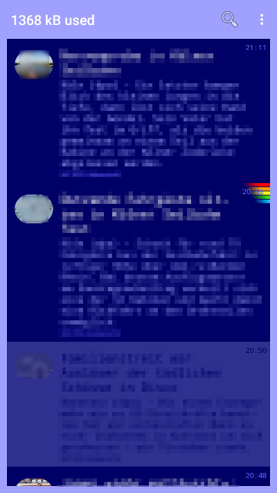

# AnotherRSS (C64 branch)

The App *AnotherRSS* is a Atom RSS Feed Reader and very similar to [ViboraFeed](https://github.com/no-go/ViboraFeed).
You can add many RSS-Urls.

This Branch has a lovely classic retro blue/lightblue design, other icon, other design and shows the database size at the top instead of the App name. It runs in fullscreen mode.

APK without Google Store: [app-release.apk](https://raw.githubusercontent.com/no-go/AnotherRSS/com64/app/app-release.apk)

