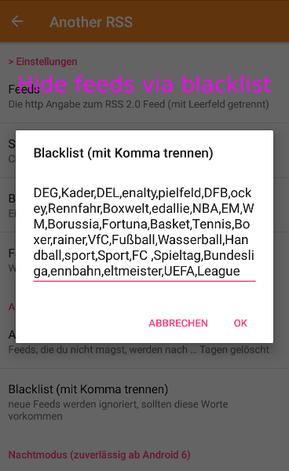

# AnotherRSS

The App *AnotherRSS* is a Atom RSS Feed Reader and very similar to [ViboraFeed](https://github.com/no-go/ViboraFeed).
You can add (space seperated) your RSS-Urls.

Support me: 

## Features

- english and german interface
- it is orange
- everyting in one list
- images
- landscape mode with web preview
- search text content
- night mode
- every news is a notification
- mark feeds as deleted, readed, favourite
- free content blacklist
- many more ...

## Get the App

You can get a signed APK from here (Android 4.1+): [APK](https://raw.githubusercontent.com/no-go/AnotherRSS/master/app/app-release.apk)

## Screenshots

## Privacy Policy

### Personal information.

Personal information is data that can be used to uniquely identify or contact a single person. I DO NOT collect, transmit, store or use any personal information while you use this app.

### Non-Personal information.

I DO NOT collect non-personal information like user's behavior:

 -  to solve App problems
 -  to show personalized ads

The google play store collect non-personal information such as the data of install (country and equipment).

### Privacy Questions.

If you have any questions or concerns about my Privacy Policy or data processing, please contact me.
